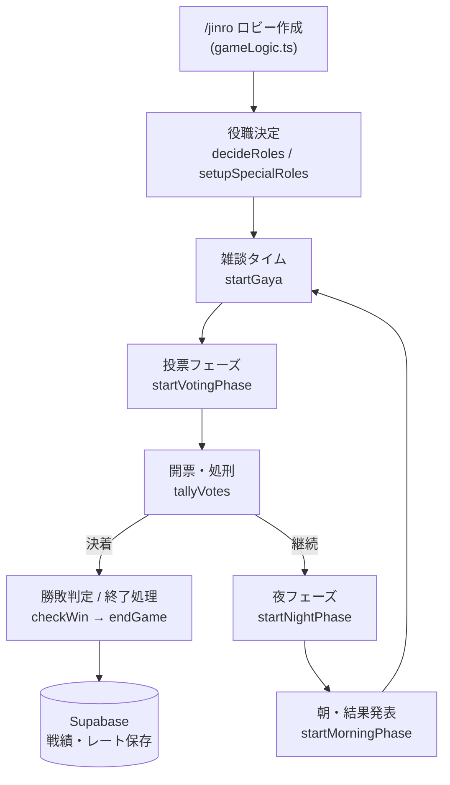
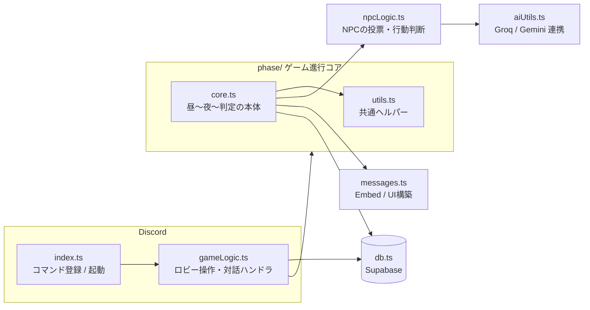

# 🍅 Tomatobot

Discord 上で動作する、NPC（AI）参加対応の人狼ゲーム Bot です。
人間のプレイヤーが少なくても NPC が会話・投票・夜のアクションを行うため、4人からゲームを開始できます。

[](https://github.com/lazytomato17-ops/tomatobot/actions/workflows/ci.yml)
[](https://github.com/lazytomato17-ops/tomatobot/actions/workflows/docker-build.yml)
[](./LICENSE)

---

## 目次

- [特徴](#特徴)
- [スクリーンショット・コマンド一覧](#コマンド一覧)
- [対応役職](#対応役職)
- [アーキテクチャ](#アーキテクチャ)
- [ディレクトリ構成](#ディレクトリ構成)
- [セットアップ](#セットアップ)
- [開発](#開発)
- [デプロイ](#デプロイRender)
- [コントリビュート](#コントリビュート)
- [ライセンス](#ライセンス)

---

## 特徴

- 🤖 **NPC対応** — 人間が2〜3人しかいなくても、AI（Groq / Gemini）が操作するNPCが参加して進行
- 🎭 **20種類以上の役職** — 村人陣営・人狼陣営・第三陣営それぞれにユニークな役職を収録
- 🏆 **レーティングシステム** — 練習試合（レート変動なし）とランクマッチ（レート変動あり）を切り替え可能
- 📊 **戦績・シーズン管理** — Supabase に対戦結果を保存し、週間/月間ランキングを自動投稿
- ⚙️ **柔軟なロビー設定** — 役職構成、人狼数、投票方式などをDiscordのUIから細かく設定可能
- 🎙️ **AIによる実況・MVPコメント生成** — ゲーム終了後にAIがプレイを振り返るコメントを生成

## コマンド一覧

| コマンド                           | 説明                                                                 |
| ---------------------------------- | -------------------------------------------------------------------- |
| `/jinro`                           | 人狼の募集ロビーを開始                                               |
| `/stats`                           | 自分の戦績を表示                                                     |
| `/reset`                           | 現在のチャンネルのゲームを強制終了・リセット（要メッセージ管理権限） |
| `/preset save\|load\|list\|delete` | 主催者向け：役職構成などの設定をプリセットとして保存・呼出           |

管理者（OP）専用コマンドとして `/games` `/kick` `/announce` `/forceskip` `/sysinfo` `/penalty` なども収録しています（詳細は `src/index.ts` を参照）。

## 対応役職

村人陣営・人狼陣営・第三陣営を合わせて、20種類以上の役職に対応しています。各役職の能力・勝利条件は `src/roles.ts` の `ROLE_CATALOG` に一元化されており、ゲーム内の役職説明（`/jinro` のロビーUI）もここから自動生成されます。

代表的な役職:

| 陣営        | 役職例                                                                |
| ----------- | --------------------------------------------------------------------- |
| 🧑‍🌾 村人陣営 | 占い師・霊能者・騎士・共有者・検死官・市長・猫又・独裁者・暗殺者 など |
| 🐺 人狼陣営 | 人狼・饒舌な人狼・狂人・狂信者・妖術師・分断者                        |
| 🌟 第三陣営 | 妖狐・テルテル・キューピッド・純愛者・神                              |

## アーキテクチャ

ゲーム進行は「ロビー → 役職決定 → 昼（雑談）→ 投票 → 夜（アクション）→ 朝（結果発表）」のループで構成されており、`src/phase/core.ts` がこのループ全体を管理しています。





> **Note: なぜ `phase/core.ts` は1ファイルのままなのか**
> ゲーム進行の各フェーズ（昼・投票・夜・朝・勝敗判定）は「投票後に夜を呼ぶ」「夜が明けたら昼を呼ぶ」のように互いを直接呼び合う構造になっています。これを無理に複数ファイルへ分割すると TypeScript/CommonJS の循環import（読み込み順序によって関数が `undefined` になる不具合）を誘発しやすいため、安全性を優先して意図的に集約しています。一方で、他のロジックから独立して呼び出せる純粋なヘルパー関数（タイマー管理・役職抽選など）は `phase/utils.ts` に分離し、見通しを改善しています。

## ディレクトリ構成

```
src/
├── index.ts          # エントリポイント／スラッシュコマンド登録／Botログイン
├── gameLogic.ts       # ロビーのボタン・セレクトメニュー操作、ゲーム開始処理
├── phase/
│   ├── index.ts       # 公開窓口（utils / core を re-export）
│   ├── core.ts         # 昼・投票・夜・朝・勝敗判定・終了処理（ゲーム進行の本体）
│   └── utils.ts        # タイマー管理・役職抽選などの共通ヘルパー
├── npcLogic.ts          # NPCの投票先・行動判断ロジック
├── aiUtils.ts            # Groq / Gemini を使った会話・コメント生成
├── messages.ts             # Embed・ボタン・セレクトメニューなどUI構築
├── gameConfig.ts            # 文言テンプレート・タイミング設定・GAYA辞書
├── roles.ts                   # 役職定義・陣営判定
├── db.ts                       # Supabase連携（戦績・レート・プリセット）
├── admin.ts                     # 管理者向け補助関数
├── state.ts                      # ゲームステートのメモリ管理（チャンネルID単位）
└── types.ts                       # 型定義（GameState / Player / Settings など）
```

## セットアップ

### 必要要件

- Node.js 22 以上
- Discord Bot トークン（[Discord Developer Portal](https://discord.com/developers/applications) で発行）
- Supabase プロジェクト（戦績・レート保存用）
- Groq / Gemini の API キー（NPC会話生成用）

### 手順

```bash
git clone https://github.com/lazytomato17-ops/tomatobot.git
cd tomatobot

npm install
cp .env.example .env
# .env を開いて各種トークン・APIキーを設定してください
```

`.env` に設定する項目の詳細は [`.env.example`](./.env.example) を参照してください。

```bash
npm run dev      # ts-node で直接起動（開発用）
# または
npm run build && npm start   # ビルドしてから起動（本番相当）
```

## 開発

```bash
npm run typecheck   # 型チェックのみ（tsc --noEmit）
npm run lint         # ESLint
npm run lint:fix       # ESLint の自動修正
npm run test             # ユニットテスト（Vitest）
npm run test:watch         # ユニットテストをウォッチモードで実行
npm run format               # Prettier で整形（新規・変更箇所への適用を推奨）
npm run ci                     # typecheck + lint + test をまとめて実行（CIと同じチェック）
```

> 既存コードは Prettier 未整形のまま残しています（一括整形すると差分が巨大になりレビューが困難になるため）。新規追加・変更するコードについては `npm run format` の適用を推奨します。

`npm install` 時に [Husky](https://typicode.github.io/husky/) が自動セットアップされ、`git commit` のたびに以下が走ります。

- ステージされたファイルに対する ESLint（自動修正）・Prettier（[lint-staged](https://github.com/lint-staged/lint-staged)経由）
- プロジェクト全体の型チェック（`tsc --noEmit`）

### テスト

`src/roles.ts`（役職定義・陣営判定）や `src/db.ts`（レート計算・勝敗判定）など、Discord.js に依存しない純粋関数を中心にユニットテストを用意しています（`src/**/*.test.ts`）。

ゲーム進行の本体（`src/phase/core.ts`）は Discord.js のオブジェクトやタイマーに強く依存しているため、現状ユニットテストの対象外です。実際の動作確認は Discord 上でのプレイテストを推奨します。

### コーディング規約

- ESLint は `@typescript-eslint/no-explicit-any` を warning 止まりにしています。Discord.js の型が広範囲で `any` を使わざるを得ない既存設計のためです。新規コードではできる範囲で具体的な型を使ってください。
- `phase/core.ts` に新しいフェーズ関数を追加する場合、循環import を避けるため同ファイル内に留めることを推奨します。独立して呼び出せる純粋関数であれば `phase/utils.ts` へ。

## デプロイ（Render）

[`render.yaml`](./render.yaml) に Render Blueprint を定義済みです。

1. Render ダッシュボードで **New +** → **Blueprint** を選択
2. このリポジトリを指定
3. 環境変数（`DISCORD_TOKEN` など、`render.yaml` 内で `sync: false` になっている項目）をダッシュボード上で入力
4. デプロイ完了後、`main` ブランチへの push で自動再デプロイされます（`autoDeploy: true`）

### GitHub Actions からの明示的デプロイ（任意）

`.github/workflows/deploy.yml` は、CI（型チェック・Lint・ビルド）が成功した後に Render の **Deploy Hook** を叩くワークフローです。Render の Git 連携による自動デプロイのみで運用する場合、このワークフローは未設定のままで構いません（`RENDER_DEPLOY_HOOK_URL` シークレットが無い場合は何もせず正常終了します）。

有効化する場合:

1. Render ダッシュボード → 対象サービス → **Settings** → **Deploy Hook** から URL を発行
2. GitHub リポジトリの **Settings** → **Secrets and variables** → **Actions** に `RENDER_DEPLOY_HOOK_URL` という名前でその URL を登録

### コンテナイメージを手元でビルドする場合

```bash
docker build -t tomatobot .
docker run --env-file .env -p 10000:10000 tomatobot
```

## コントリビュート

Issue・Pull Request 歓迎です。詳細は [CONTRIBUTING.md](./CONTRIBUTING.md) を参照してください。

## ライセンス

[MIT License](./LICENSE)
